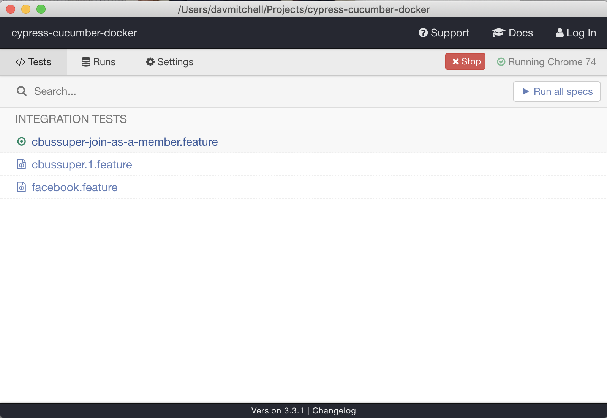
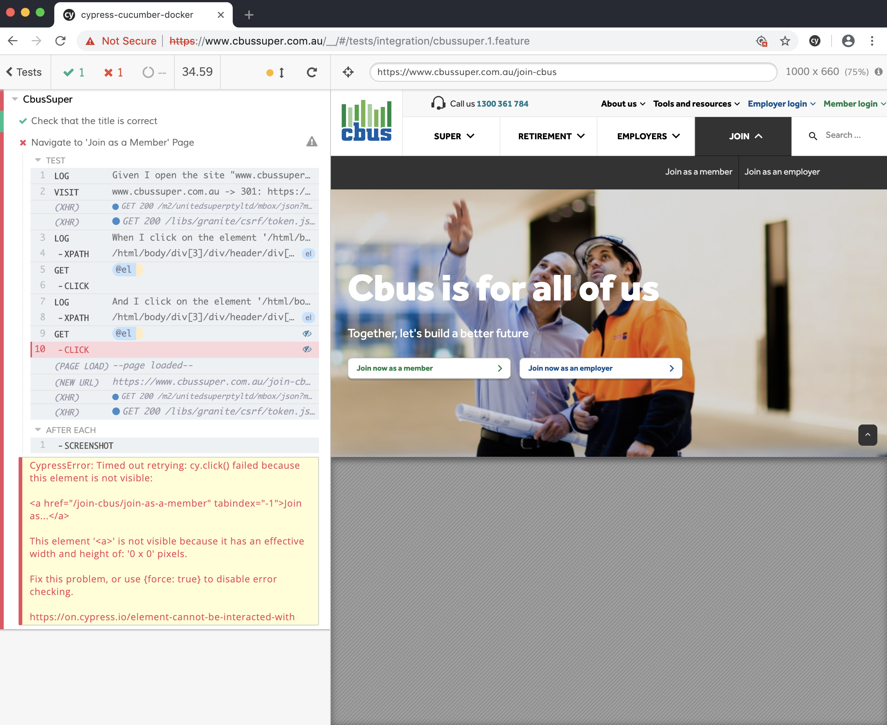
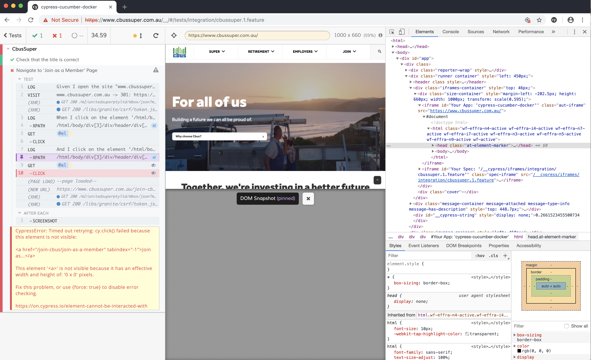

# Cypress-Cucumber-Docker

## Docker container to run Cucumber tests against Cypress

Note that there is a pre-defined set of Cucumber step files under `./cypress/support/step_definitions`. These are intended to speed up the creation of Cucumber/Gherkin files and reduce the expertise required to do so

A screenshot is taken at the end of each test execution, and a MP4 video is captured of each feature file while it executes.

Results are captured in JUnit format, and written both to file and to the console

## Instructions

### Setting up to run tests inside containers

To build a container image locally

`$ docker build . -t ccd`

To run using built-in feature file, with results being written to `./results` directory

`$ docker run -v "$(pwd)/results:/results" --ipc=host ccd:latest`

To run supplying your own feature file/s, assuming they're in `./cypress/integration`

`$ docker run -v "$(pwd)/results:/results" -v "$(pwd)/cypress/integration:/cypress/integration" --ipc=host ccd:latest`

To run supplying your own feature file/s, assuming they're in `./cypress/integration`, AND a set of your own custom step implementations, assuming they're in `./cypress/support/step_definitions/custom`

`$ docker run -v "$(pwd)/results:/results" -v "$(pwd)/cypress/integration:/cypress/integration" -v "$(pwd)/cypress/support/step_definitions/custom:/cypress/support/step_definitions/custom" --ipc=host ccd:latest`

### To run/debug tests on your local system (not inside containers)

First install all the dependency files

`$ npm install`

Now you've got 2 options - either run the tests headless (which is a fairly close simulation of how they'll run inside containers, or within CI) or run them with full visibility. Running tests with full visibility (i.e. not headless) is very handy while you're building and debugging tests cases; get them working non-headless, then ensure they still work headless, then copy them where CI can run them.

#### Headless

`$ npm run cypress-run`

#### Run with full visibility inside browser

`$ npm run cypress-open`

You'll then see a window popup that looks something like this 
Note that your feature files are highlighted - if you click on one of them, it'll run inside and you can view the results.

The results will look something like this  with the steps of your test case on the left hand side and a browser viewport on the right hand side.

You can then click on the various links on the left hand side, and the browser viewport will change to align with what the browser "could see" at the point that step in your test was executed.

You can also interact with the browser viewport at the same time. The following screenshot  shows a step in the test highlighted (and thus the browser view is aligned to the point where that test was executed), then I've right-clicked on the browser viewport and selected "Inspect" so I can see a view of the HTML & DOM of the page at that point in time.

_As long as you leave the Cypress test dashboard open_, you can edit your feature file, save it, and the Cypress dashboard will automatically re-execute all the tests in that feature file. This makes for a very fast workflow in writing and debugging tests.

Furthermore, if you tag individual test scenarios with `@focus`, you can force the testrunner (and the Cypress dashboard) to only run those tests and ignore other scenarios. Just remember to remove the `@focus` tags when you're finished debugging if you want all the remaining tests to execute.

...This is probably the best experience available for debugging browser automation tests!
